6. Buatlah file README yang berisi:
   - Deskripsi aplikasi web
   - Daftar requirement
   - Cara instalasi
   - Cara menjalankan server
   - Screenshot tampilan aplikasi (tidak perlu semua kasus, minimal 1 per halaman), dan
   - Penjelasan mengenai pembagian tugas masing-masing anggota (lihat formatnya pada bagian pembagian tugas).

# Deskripsi aplikasi web

Aplikasi ini adalah aplikasi web sederhana yang dapat digunakan untuk mendengar lagu serta melihat album dengan mengambil contoh dari Spotify. Aplikasi web ini dibuat dalam PHP, HTML, CSS, dan JS tanpa framework, dengan mengutilisasikan XHR sebagai Ajax. Database dari web ini terdapat di awan dengan menggunakan PostgreSQL. Aplikasi ini dibuat untuk memenuhi tugas besar mata kuliah Pemrograman Aplikasi Berbasis Web.

# Daftar requirement

# Cara instalasi

1. Clone repository ini
2. Install XAMPP or Docker

# Cara menjalankan server

### XAMPP

Pindahkan isi dari repository ini ke htdocs pada XAMPP. Konfigurasi database dapat dilihat pada config/.env .

### Docker

`docker compose up`

# Screenshot tampilan aplikasi

### Login Page

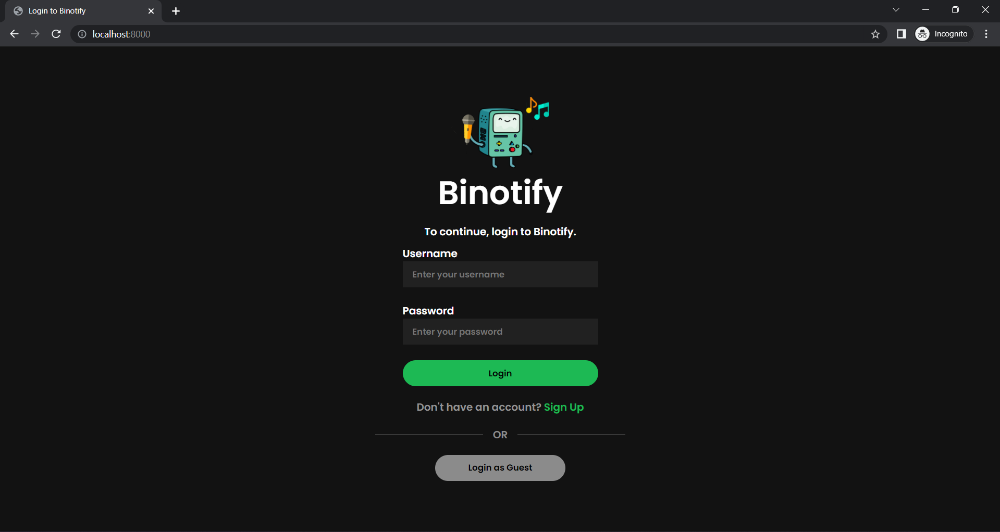

### Register Page

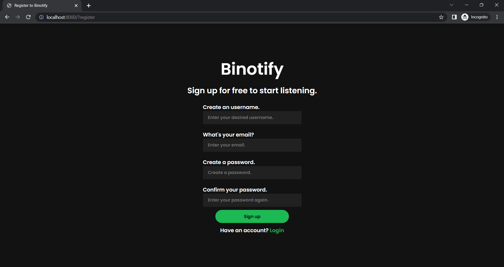

### Home Page

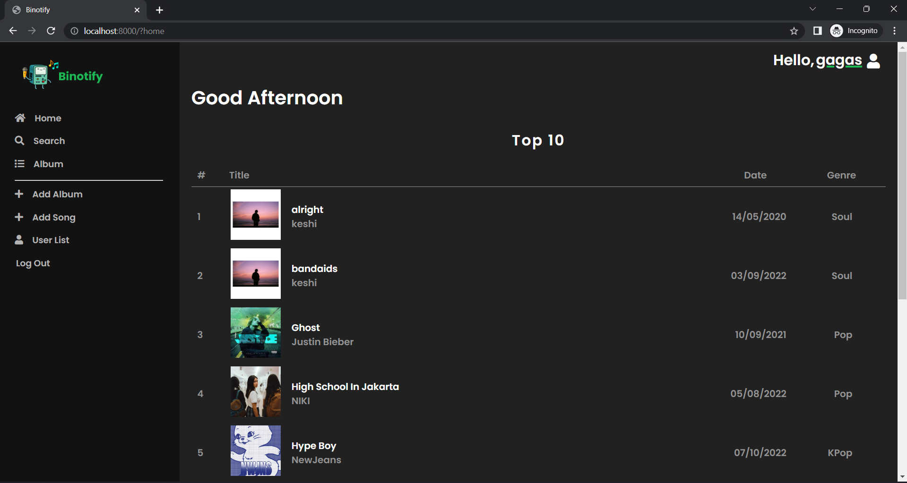

### Search, Sort, Filter Page

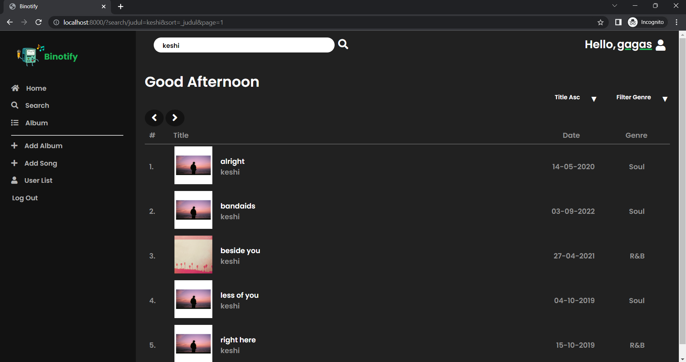

### Daftar Album Page

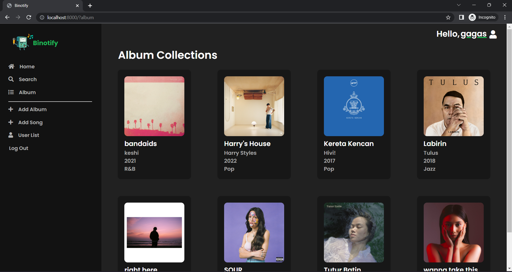

### Detail Album Page

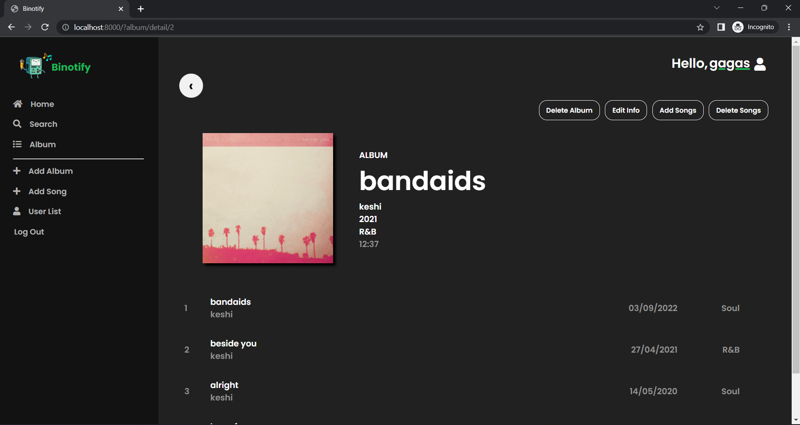

### Detail Lagu Page

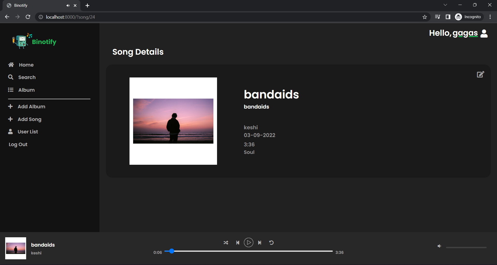

### Edit Album

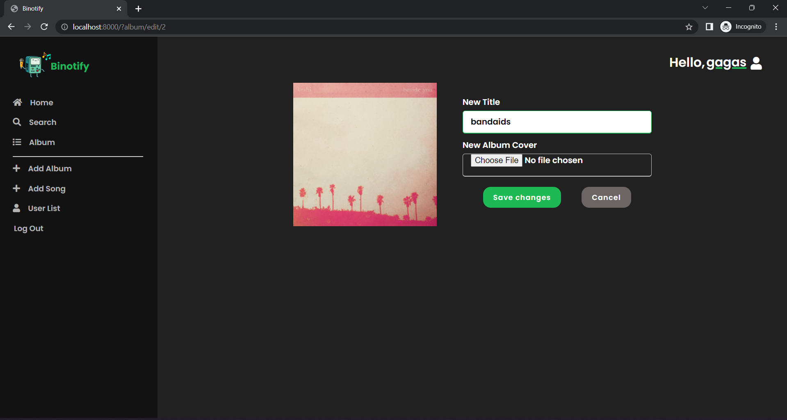

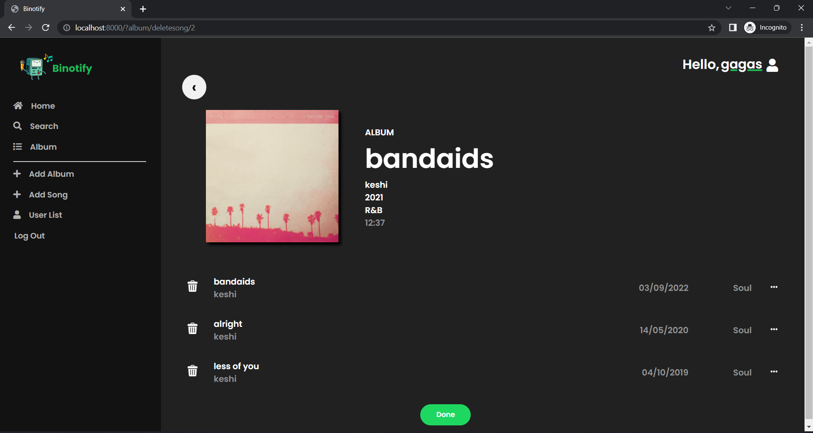

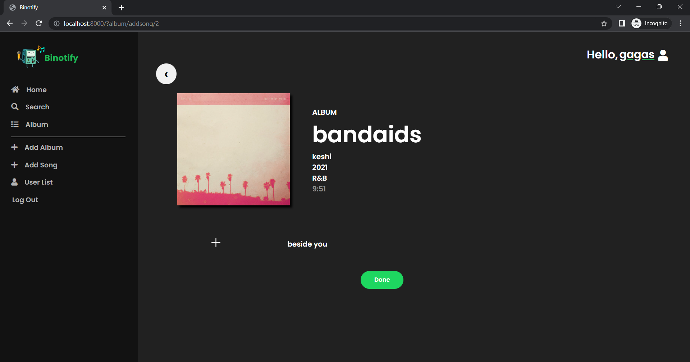

### Edit Lagu

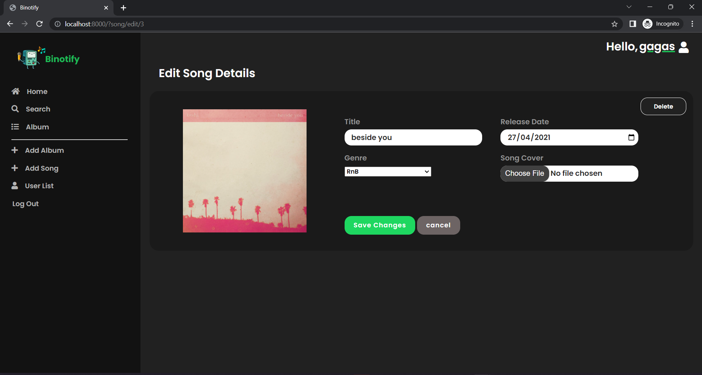

### Tambah Album

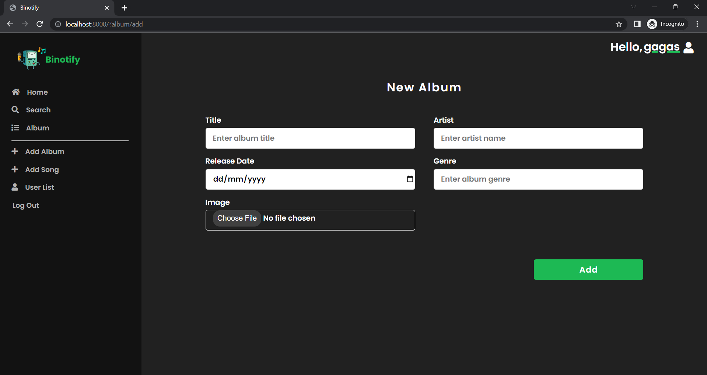

### Tambah Lagu

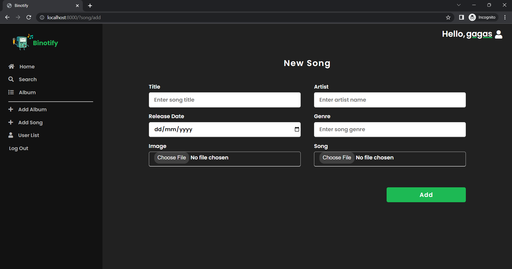

### Daftar User

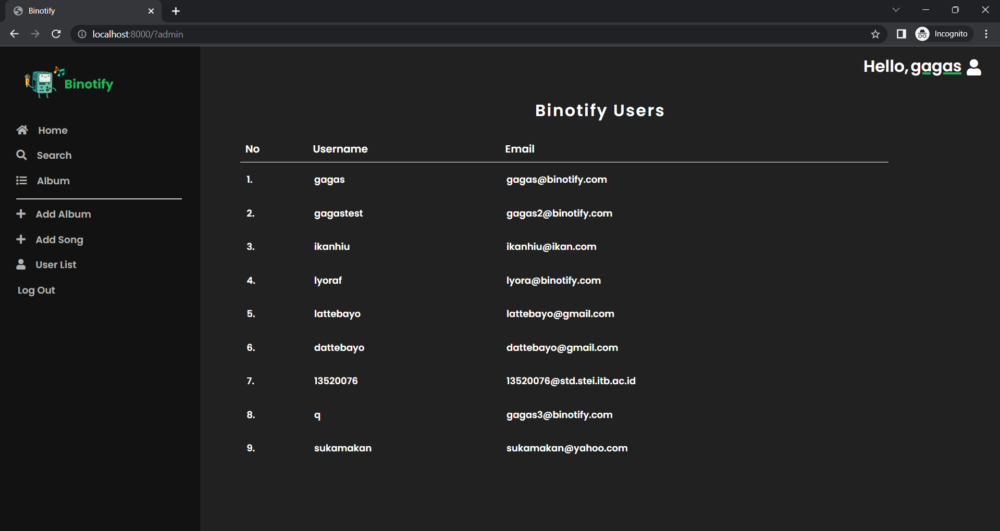

### 404 Page

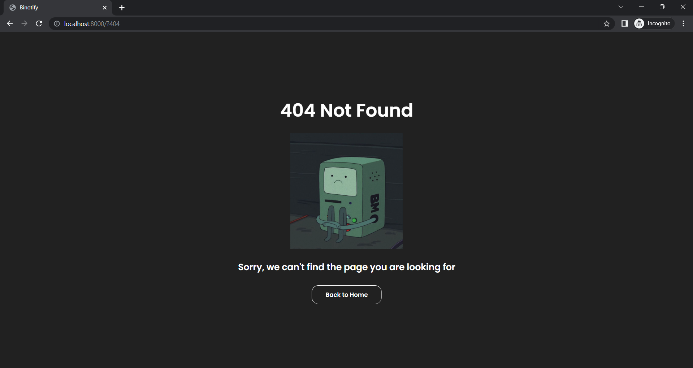

# Pembagian tugas

## Frontend / Client-side

1. Login: 13520016, 13520073
2. Register: 13520016, 13520073
3. Home: 13520073
4. Daftar Album: 13520076
5. Search, Sort, Filter: 13520016, 13520073
6. Detail Lagu: 13520073
7. Detail Album: 13520076
8. Edit Lagu: 13520073
9. Edit Album: 13520076
10. Tambah Album: 13520076
11. Tambah Lagu: 13520073
12. Daftar User: 13520073
13. 404 : 13520076
14. Navbar: 13520073
15. Responsive Adjustments: 13520073, 13520076
16. Global Styling: 13520016
17. Initial Design: 13520073, 13520076

## Backend / Server-side

1. Auth (Login, Register, Logout): 13520016
2. Guest & Limiting: 13520016, 13520076
3. Home: 13520073
4. Search, Sort, Filter: 13520016
5. Detail Lagu: 13520073
6. Detail Album: 13520076
7. Daftar Album: 13520076
8. Edit Lagu: 13520016, 13520073
9. Edit Album: 13520016
10. Tambah Album: 13520016
11. Tambah Lagu: 13520016
12. Daftar User: 13520073
13. Initial Project, Database & Docker Setup: 13520016

# New Feature

## Frontend / Client-side

1. List Premium Artist: 13520073
2. List Premium Songs by Artist: 13520073
3. List All Premium Songs (Bonus for UX): 13520073

## Backend / Server-side

1.
